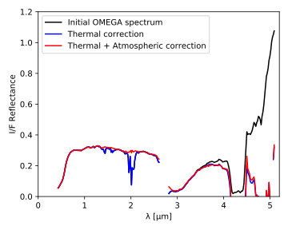
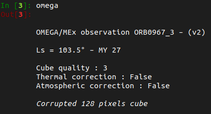
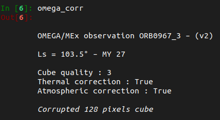

In addition to the raw data importation, which is done similarly to the IDL
`readomega`, OMEGA-Py also includes build-in functions to perform the atmospheric
and thermal corrections on a previously loaded [`OMEGAdata`](../reference/omega_data/#omega_data.OMEGAdata) object, using methods
described for instance in Jouglet et al. (2007)[^1] or Langevin et al. (2005)[^2].

[^1]: D. Jouglet, F. Poulet, R. E. Milliken, et al. (2007). 
Hydration state of the Martian surface as seen by Mars Express OMEGA : 1. Analysis of the 3 μm hydration feature. 
*Journal of Geophysical Research: Planets, 112*, E08S06. 
[doi:10.1029/2006JE002846](http://dx.doi.org/10.1029/2006JE002846)

[^2]: Y. Langevin, F. Poulet, J.-P. Bibring & B. Gondet (2005). 
Sulfates in the North Polar Region of Mars Detected by OMEGA/Mars Express.
*Science, 307*, 1584-1586. 
[doi :10.1126/science.1109091](http://dx.doi.org/10.1126/science.1109091)

<figure markdown>
  
  <figcaption>
    Illustration of the atmospheric and thermal corrections applied to an OMEGA spectrum 
    (figure 1 from Stcherbinine et al., 2021)[^3].
  </figcaption>
</figure>

[^3]: A. Stcherbinine, M. Vincendon, F. Montmessin, P. Beck (2021). 
Identification of a new spectral signature at 3 µm over Martian northern high latitudes: implications for surface composition. 
*Icarus, 369*, 114627. 
[doi:10.1016/j.icarus.2021.114627](https://doi.org/10.1016/j.icarus.2021.114627)

In the following, we assume that we have already loaded an OMEGA observation as follows:
~~~python
import omegapy.omega_data as od

omega = od.OMEGAdata('0967_3')
~~~

## Atmospheric correction

The atmospheric correction of a data cube is performed using the volcano-scan
technique, by scaling a typical atmospheric spectrum from the 2 μm
CO~2~ atmospheric band (Langevin et al., 2005)[^2]. 

!!! info
    Upcoming versions will allow the user to use a custom atmospheric spectrum
    instead of the one currently provided. 

Two methods are available to scale the atmospheric spectrum:

???+ note "Method 1"
    The first method (mostly used) adjust the atmospheric scaling to force the values of 
    the reflectance at 1.93 and 2.01 μm to be the same.
    ~~~python
    omega_corr_atm = od.corr_atm(omega)     # Method 1
    ~~~

???+ note "Method 2"
    The second method (less used) adjust the atmospheric scaling to have the "flattest" spectra
    between 1.93 and 2.00 μm. As it requires a call to a minimization function, the computation
    time for this method is longer than for the first one.
    ~~~python
    omega_corr_atm2 = od.corr_atm2(omega)   # Method 2
    ~~~

<!--The atmospheric correction is performed by using: -->
<!--~~~python-->
<!--omega_corr_atm = od.corr_atm(omega)     # Method 1-->

<!--omega_corr_atm2 = od.corr_atm2(omega)   # Method 2-->
<!--~~~-->

## Thermal correction

If the thermal contribution of the planet in the OMEGA spectra can be neglected for wavelength 
smaller than ~3 μm, it has to be taken into account when using larger wavelength (i.e., data from
the L-channel ; see figure above).

The thermal correction can also be performed using two methods. 
However, only the first one has been optimized to use 
[`multiprocessing`](https://docs.python.org/3/library/multiprocessing.html) for now.

???+ note "Method 1 (with C-channel)"
    The reflectance at 5 μm is theoretically estimated from the measured reflectance at 2.4 μm,
    using typical spectra of the bright and dark regions of Mars from Calvin (1997)[^4].
    Then the additional black body component is derived and substracted to the entire spectrum
    (Jouglet et al., 2007)[^1].

    In addition, to reduce the computation time of the thermal correction, parallel
    processing has been implemented using the 
    [`multiprocessing`](https://docs.python.org/3/library/multiprocessing.html) 
    module for this method. 
    ~~~python
    omega_corr_them = od.corr_therm(omega, npool=1)     # Method 1 with 1 single process
    # or
    omega_corr_them = od.corr_therm(omega, npool=10)    # Method 1 with 10 simultaneous processes
    ~~~
    !!! info "Using multiple processes"
        `npool` controls the number of simultaneous processes used to
        compute the thermal correction of the OMEGA data cube.
        I.e., it defines the number of [`multiprocessing.Pool`](https://docs.python.org/3/library/multiprocessing.html#multiprocessing.pool.Pool) that will be created.

???+ note "Method 2 (without C-channel)"
    If the data from the C-channel are not available, the first method is no longer usable,
    and it is necessary to fit both the surface temperature ad the reflectance at 5 μm,
    as described in Audouard (2014)[^5].
    ~~~python
    omega_corr_them2 = od.corr_therm2(omega)            # Method 2
    ~~~

[^4]: W. N. Calvin (1997). 
Variation of the 3-μm absorption feature on Mars : Observations over eastern Valles Marineris by the Mariner 6 infrared spectrometer.
*Journal of Geophysical Research: Planets, 102*, 9097.
[doi:10.1029/96JE03767](http://dx.doi.org/10.1029/96JE03767)

[^5]: J. Audouard (2014). PhD thesis, Université Paris-Sud XI.

<!--The preferred one assumes the theoretical reflectance at 5 μm from the one at-->
<!--2.4 μm and typical spectra (Jouglet et al., 2007)[^1], but a second one has-->
<!--been implemented for cubes with no data from the C-channel (Audouard,-->
<!--2014)[^5]. -->

<!--In addition, to reduce the computation time of the thermal correction, parallel-->
<!--processing has been implemented using the multiprocessing module for the first-->
<!--method. -->

<!--For instance, one can perform the thermal correction of a data cube using 10-->
<!--simultaneous processes (for method 1 only) with:-->
<!--~~~python-->
<!--omega_corr_them = od.corr_therm(omega, npool=10)    # Method 1-->

<!--omega_corr_them2 = od.corr_therm2(omega)            # Method 2-->
<!--~~~-->

## Simultaneous atmospheric & thermal corrections

For the analysis of data from the L-channel, that requires thermal and atmospheric correction of
the spectra, one can performs both corrections at the same time with a dedicated function.
This is the recommended way if you want to perform both corrections as the atmosphere will be better
taken into account while removing the thermal correction.

???+ note "Method 1 (with C-channel)"
    For now, only the use of both methods 1 for the atmospheric and thermal corrections has been
    implemented.
    ~~~python
    omega_corr_them_atm = od.corr_therm_atm(omega, npool=10)    # Method 1-1
    ~~~
    !!! info "Using multiple processes"
        `npool` controls the number of simultaneous processes used to
        compute the thermal correction of the OMEGA data cube.
        I.e., it defines the number of [`multiprocessing.Pool`](https://docs.python.org/3/library/multiprocessing.html#multiprocessing.pool.Pool) that will be created.

!!! tip "Correcting and saving OMEGA observations in one single command"
    As the correction of an OMEGA observation can take some time, you may want to save the
    final cube to avoid reprocessing it every time.

    Instead of returning an [`OMEGAdata`](../reference/omega_data/#omega_data.OMEGAdata) object
    after processing the thermal & atmospheric corrections, it is also possible to 
    save it into a file that can be loaded later using the 
    [`corr_save_omega2`](../reference/omega_data/#omega_data.corr_save_omega2) function
    (more details [here](../data_handling/#correcting-and-saving-omega-observations-in-one-single-command)).

## Checking applied corrections

The correction status of an [`OMEGAdata`](../reference/omega_data/#omega_data.OMEGAdata) object
can be checked via the value of the booleans:
~~~python
omega.therm_corr    # True if thermal correction applied

omega.atm_corr      # True if atmospheric correction applied
~~~

Alternatively, these informations are also displayed in the interactive representation of the
object.

<!--{align=left}-->
<!--{align=right}-->

*(left) No corrections applied. (right) Both corrections applied.*

The informations about the method applied for the corrections can be accessed via:
~~~python
omega.therm_corr_infos

omega.atm_corr_infos
~~~

<!--~~~python-->
<!--In [1]: omega-->
<!--Out[1]: -->
<!--~~~-->

<!--=== "test 1"-->
  <!--bla-->

<!--=== "test 2"-->
  <!--blabla-->
