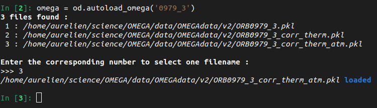
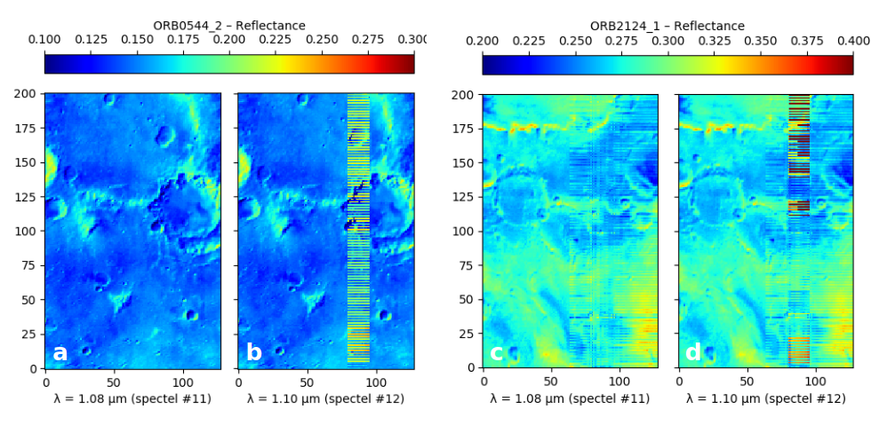
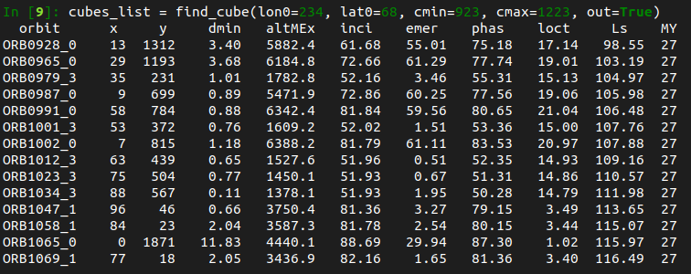

In the following, we assume that we have imported the module as follows:
~~~python
import omegapy.omega_data as od
import omegapy.useful_functions as uf
~~~

## Saving & Loading OMEGA data

The importation and correction of OMEGA data cubes take some time to be achieved.
Thus, it is convenient to be able to directly save and load 
[`OMEGAdata`](../reference/omega_data/#omega_data.OMEGAdata) object
to avoid reprocessing them every time.

The saving and loading is done using the [`pickle`](https://docs.python.org/3/library/pickle.html)
module.

### Saving OMEGA data
Assuming we have an [`OMEGAdata`](../reference/omega_data/#omega_data.OMEGAdata) object
`omega`, the easiest and recommended way to save it is to use the 
[`autosave_omega`](../reference/omega_data/#omega_data.autosave_omega) function:

~~~python
od.autosave_omega(omega)
~~~

!!! info
    This function will automatically define the filename depending on the OMEGA cube ID,
    the OMEGA-Py major version, and the status of the thermal and atmospheric corrections.

    Observations that are saved with
    [`autosave_omega`](../reference/omega_data/#omega_data.autosave_omega)
    can then be loaded easily with the
    [`autoload_omega`](../reference/omega_data/#omega_data.autoload_omega)
    function, as they use the same filenaming convention.

If you prefer to manually define the filename when saving the data, it can be done
by using the [`save_omega`](../reference/omega_data/#omega_data.save_omega) function
instead.

### Correcting and saving OMEGA observations in one single command
OMEGA-Py includes functions that will compute the thermal & atmospheric corrections as
described [here](../data_correction/#simultaneous-atmospheric-thermal-corrections) and
then automatically save the result for further use with
[`autosave_omega`](../reference/omega_data/#omega_data.autosave_omega).

For one OMEGA cube, this can be done by calling the
[`corr_save_omega2`](../reference/omega_data/#omega_data.corr_save_omega2) function
(instead of [`corr_therm_atm`](../reference/omega_data/#omega_data.corr_therm_atm)
which will apply the corrections and return the newly created
[`OMEGAdata`](../reference/omega_data/#omega_data.OMEGAdata) object).

!!! example
    ~~~python
    od.corr_save_omega2(
        '0967_3',       # Cube ID
        npool=10,       # Number of parallel processes for the thermal correction
        compress=True,  # Remove the radiance (cube_i) cube to decrease the size of the saved file by replacing it by `None`
        )
    ~~~

Similarly, it can also be done directly for a list of OMEGA observations (that you would need
to process for a specific project) using the 
[`corr_save_omega2_list`](../reference/omega_data/#omega_data.corr_save_omega2_list) function.
The only difference with the call for one observation is that here the cube ID (`str`) is 
replaced by a list of cube IDs.

!!! example
    ~~~python
    od.corr_save_omega_list2(
        ['0967_2', '0967_3', '0967_4'],     # List of cube IDs
        npool=10,       # Number of parallel processes for the thermal correction
        compress=True,  # Remove the radiance (cube_i) cube to decrease the size of the saved file by replacing it by `None`
        )
    ~~~

### Loading OMEGA data
Assuming that you have saved an [`OMEGAdata`](../reference/omega_data/#omega_data.OMEGAdata) object
using the [`autosave_omega`](../reference/omega_data/#omega_data.autosave_omega) function,
it can be easily loaded with 
[`autoload_omega`](../reference/omega_data/#omega_data.autoload_omega).
As in this case, the filenames and path follows a specific convention, all it needs is
the OMEGA cube number and the status of the thermal and atmospheric corrections.

~~~python
omega = od.autoload_omega('0967_3', therm_corr=False, atm_corr=False)       # Cube 0967_3 with no corrections

omega_corr = od.autoload_omega('0967_3', therm_corr=True, atm_corr=True)    # Cube 0967_3 with both corrections
~~~

!!! tip "Not specifying the corrections status"
    If the correction status is not specified, or the exact ID of the OMEGA cube is not provided
    and there is an ambiguity, it will show all the matching products and ask you to choose the one
    you want to load by entering the corresponding number (see figure below).

    !!! example
        ~~~python
        omega = od.autoload_omega('0967_3')
        ~~~

        <figure markdown>
          
          <figcaption>
            Loading of OMEGA cube *0967_3* with both thermal and atmospheric corrections applied.
          </figcaption>
        </figure>

It is also possible to load an previously saved OMEGA observation by specifying its exact
filename, using the [`load_omega`](../reference/omega_data/#omega_data.load_omega) function:

~~~python
omega = od.load_omega('/path/to/saved/data/ORB0967_3.pkl')
~~~

### Loading multiple OMEGA observations
If needed to load multiple previously computed and saved OMEGA observations, it can be done
by using the 
[`load_omega_list2`](../reference/omega_data/#omega_data.load_omega_list2) function, which
is based on [`autoload_omega`](../reference/omega_data/#omega_data.autoload_omega).
The only difference between the two is that in this case the cube ID (`str`) is replaced by a list
of cube IDs:

~~~python
omega_list = od.load_omega_list2(
    ['0967_2', '0967_3', '0967_4', '0979_3'],   # List of OMEGA cubes to load
    therm_corr=True,    # With thermal correction applied
    atm_corr=True       # With atmospheric correction applied
    )
~~~

Alternatively, it is also possible to use a more manual method with the
[`load_omega_list`](../reference/omega_data/#omega_data.load_omega_list) function, which
is based on [`load_omega`](../reference/omega_data/#omega_data.load_omega) and takes as an
argument the full basename of the files to load.

~~~python
omega_list = od.load_omega_list('/path/to/saved/data/ORB0967_?.pkl')
~~~

## Finding wavelength indexes

The spectra are automatically "cleaned" during the importation of the binary files into
an [`OMEGAdata`](../reference/omega_data/#omega_data.OMEGAdata) object by:

 * sorting the wavelength in ascending order
 * removing the wavelength overlap between the different channels
 * removing the corrupted spectels, as identified by the `ic` array

Consequently, the index of a specific wavelength may change depending on the OMEGA observation
considered, especially across the time of the mission.
So we provided an easy way to search for the index of a value in an array, that can be used
to easily retrieve the index of a specific wavelength, which will be needed to compute
any spectral criteria: the
[`where_closer`](../reference/useful_functions/#useful_functions.where_closer) and
[`where_closer_array`](../reference/useful_functions/#useful_functions.where_closer_array)
functions from [`omegapy.useful_function`](../reference/useful_functions).

~~~python
omega = od.OMEGAdata('0967_3')      # Loading an OMEGA observation

i_108 = uf.where_closer(1.085, omega.lam)   # Index of λ=1.085μm

i_150, i_226 = uf.where_closer_array([1.5, 2.26], omega.lam)    # Indexes of λ=1.5μm and λ=2.26μm
~~~

## Dealing with OMEGA spectra that have different wavelength arrays

As mentioned above, it is possible that different OMEGA observations may not have the exact same
wavelength array, as some spectels got corrupted across the duration of the mission. 
It may be of importance especially if you want to compute operations over multiple spectra
from different observations (spectral ratio, average...), so OMEGA-Py include some
functions to help you tackle this: the
[`shared_lam`](../reference/omega_data/#omega_data.shared_lam) and
[`shared_lam_omegalist`](../reference/omega_data/#omega_data.shared_lam_omegalist) functions.

!!! example "Example 1: individual spectra"
    Let's assume we have 3 spectra as 1D arrays `sp1`, `sp2`, `sp3` and their corresponding
    wavelength arrays `lam1`, `lam2`, `lam3`.

    We can find the common wavelengths with
    ~~~python
    lam_new = od.shared_lam([lam1, lam2, lam3])     # Array with all the common wavelengths
    ~~~

    Then we sample the spectra to match the new common wavelength array
    ~~~python
    sp1_new = sp1[uf.where_closer_array(lam_new, lam1)]
    sp2_new = sp2[uf.where_closer_array(lam_new, lam2)]
    sp3_new = sp3[uf.where_closer_array(lam_new, lam3)]
    ~~~

    And we can now perform any operations on the spectra as they all have the same dimension
    and wavelengths.

!!! example "Example 2: list of OMEGA observations"
    Let's assume we have 3 [`OMEGAdata`](../reference/omega_data/#omega_data.OMEGAdata)
    objects `omega1`, `omega2`, `omega3`.

    We can find the common wavelengths with
    ~~~python
    lam_new = od.shared_lam_omegalist([omega1, omega2, omega3])     # Array with all the common wavelengths
    ~~~

    Then we search for the indexes that correspond to the wavelengths of the new array
    ~~~python
    i_lam1 = uf.where_closer_array(lam_new, omega.lam1)
    i_lam2 = uf.where_closer_array(lam_new, omega.lam2)
    i_lam3 = uf.where_closer_array(lam_new, omega.lam3)
    ~~~

    And we just need to sample the spectra to match the new common wavelength array
    when we get them from the data cube.
    ~~~python
    sp1 = omega1.cube_rf[x1, y1, i_lam1]  # Loading the spectrum from pixel (x1, y1) of omega1, sampled on the new wavelength array
    sp2 = omega2.cube_rf[x2, y2, i_lam2]  # Loading the spectrum from pixel (x2, y2) of omega2, sampled on the new wavelength array
    sp3 = omega3.cube_rf[x3, y3, i_lam3]  # Loading the spectrum from pixel (x3, y3) of omega3, sampled on the new wavelength array
    ~~~

    And we can now perform any operations on the spectra as they all have the same dimension
    and wavelengths.
    

## Generating masks

For the scientific analysis of OMEGA data some pixels of the data cubes need to be
removed because they correspond to internal calibration measurements, or are corrupted.
Extensive description of filtering criteria that have been used for the analysis of OMEGA
observations can be found in several published studies, e.g.,
Langevin et al. (2007)[^2], Poulet et al. (2007)[^3], Ody et al. (2012)[^4], 
Vincendon et al. (2015)[^5], Stcherbinine et al. (2021)[^1].

[^2]: Y. Langevin, J.-P. Bibring, F. Montmessin, F. Forget, et al. (2007).
Observations of the south seasonal cap of Mars during
recession in 2004–2006 by the OMEGA visible/near-infrared imaging spectrometer
on board Mars Express. 
*JGR Planets 112 (E8)*.
[doi:10.1029/2006JE002841](http://dx.doi.org/10.1029/2006JE002841)

[^3]: F. Poulet, C. Gomez, J.-P. Bibring, Y. Langevin, et al. (2007).
Martian surface mineralogy from Observatoire pour la Minéralogie,
l'Eau, les Glaces et l'Activité on board the Mars Express spacecraft (OMEGA/MEx):
Global mineral maps. 
*JGR Planets 112 (E8)*. 
[doi:10.1029/2006JE002840](http://dx.doi.org/10.1029/2006JE002840)

[^4]: A. Ody, F. Poulet, Y. Langevin, J.-P. Bibring, et al. (2012). 
Global maps of anhydrous minerals at the surface of Mars from OMEGA/MEx.
*JGR Planets 117 (E11)*. 
[doi:10.1029/2012JE004117](http://dx.doi.org/10.1029/2012JE004117)

[^5]: M. Vincendon, J. Audouard, F. Altieri, A. Ody, (2015). 
Mars Express measurements of surface albedo changes over 2004–2010. 
*Icarus 251, 145–163*. 
[doi:10.1016/j.icarus.2014.10.029](http://dx.doi.org/10.1016/j.icarus.2014.10.029)

[^1]: A. Stcherbinine, M. Vincendon, F. Montmessin, P. Beck (2021). 
Identification of a new spectral signature at 3 µm over Martian northern high latitudes: implications for surface composition. 
*Icarus, 369*, 114627. 
[doi:10.1016/j.icarus.2021.114627](https://doi.org/10.1016/j.icarus.2021.114627)

The [`omega_mask`](../reference/omega_data/#omega_data.omega_mask) function generate masks
associated to an OMEGA observation that can be used in all the display functions presented
in [Data visualization](../data_visualization).

### Default
By default, the function will generate a mask that takes into account all the calibration lines
as described in the [*SOFT10_README.txt*](./SOFT10_readme.txt) (see below), 
but it can be refined to exclude some pixels depending on their associated observation geometry or
detector behavior using optional arguments of the function.

???+ abstract "Calibration lines – Note from the *SOFT10_README.txt*"
    The last 4 scans (16 pixels), 2 scans (32 pixels) or 1 scan (64, 128
    pixels) of `idat` and `jdat` have only IR data (spectels 0 to 255).

    There is calibration data at the beginning of each cube for the visible
    channel, at the beginning of the *ORBNNNN_0.QUB* cubes for the IR channels
    The number of calibration scans depend on the pixel length (16 to 128)
    and the summation (1, 2 or 4 for 128 pixel modes):

    * for every cube, the first scan (128 pixels x 4), 3 scans (128 x 2) 
    7 scans (128 x 1), 14 scans (64 pixels), 
    28 scans (32 pixels), 56 scans (16 pixels) of the visible channel
    (spectels 256 and above) correspond to an internal calibration

    * for cubes with names *NNNN_0* (first cube in a sequence), the first
    6 scans (128 x 4), 12 scans (128 x 2), 24 scans (128 x 1)
    48 scans (64 pixels), 96 scans (32 pixels) or 192 scans (16 pixels)
    of the IR channel (spectels 0 to 255) correspond to an internal 
    calibration (closed shutter, lamp on at 6 different levels, 
    in order 0,4,3,2,1,0).

### Customizing masks
#### Viewing geometry
The viewing geometry can affect the spectra measured by OMEGA (e.g., Pommerol & Schmitt, 2008[^6]),
so studies focussing on the surface used to restrain themselves to pixels acquired in near-nadir
mode.

Thus, if set, the `emer_lim` keyword will remove all the pixels with an emergence angle larger
than the value passed as an argument.
And similarly, the `inci_lim` keyword will remove all the pixels with an incidence angle larger
than the given value.

[^6]: A. Pommerol & B. Schmitt (2008). 
Strength of the H~2~O near-infrared absorption bands in hydrated minerals: 
Effects of measurement geometry. 
*JGR Planets 113 (E12)*.
[doi:10.1029/2008JE003197](http://dx.doi.org/10.1029/2008JE003197)

#### Detector temperature
The OMEGA IR detectors (C & L channels) have been designed and calibrated to operate at 
temperatures below 80 K, above this value the dark current level and the noise will increase.
However, a certain amount of time is needed to cool them down to this temperature before an
acquisition, so it happened that the detectors were not at their nominal temperature during the
entire acquisition of a data cube, especially as the performance of the cryocoolers started to
decline around MY 30.

If the `tempc_lim` is set, all pixels acquired with the C-channel detector at a temperature
higher than the provided one (in °C) will be removed.

#### Near-saturation of pixels
Near-saturation of some pixels can occur when observing a surface element brighter than
expected (e.g., sun-lighted tilted surface).
Vincendon et al., (2015)[^5] introduce a criterion to avoid non-linearity effects when approaching
the saturation based on the value measured by the spectel #40 (i.e., λ = 1.486μm), by excluding
pixels with a value higher than a defined threshold.

If the `limsat_c` keyword is set, pixels measured with a value higher than the given one (in DN)
will be removed.

#### Hiding corrupted columns in 128-px wide orbservations
As described in 
[Corrupted 128-px wide cubes](#corrupted-128-px-wide-cubes),
an instrumental issue perturbs 128 pixels wide observations from orbit 513 to 3283.
The easiest way to handle it is to ignore the corrupted columns.

This is done if the `hide_128` option is activated.

#### Low quality observations
In some cases, one may want to completely ignore some OMEGA cubes as they are considered as
"low quality observations".

It can be done by checking some parameters of the observation to ignore the unwanted ones
after the data importation, but as an example 
[`omega_mask`](../reference/omega_data/#omega_data.omega_mask) has its own pre-implemented
low-quality test.

If the `reject_low_quality` keyword is set to `True`, such observations will be hided by having
a mask entirely filled with `NaN`.

!!! info "Pre-implemented low quality criterion"
    Is condidered as "low quality" by the 
    [`omega_mask`](../reference/omega_data/#omega_data.omega_mask) function 
    (according to Stcherbinine et al. (2021)[^1]) any OMEGA cube that
    meet one of the conditions below.

    | Test   | Description  |
    | ----- | ----- |
    | `omega.data_quality == 0` |  Low quality cube |
    | `omega.quality == 0` |  |
    | `(numCube == 0) and (npixel == 64) and (omega.bits_per_data == 1)` | |
    | `not omega.orbit in good_orbits_OBC` |  Orbit not in the "good orbits" file (relative to on-board calibration (OBC)) |
    | `omega.target != 'MARS'` |  Mars pointing only |
    | `omega.mode_channel != 1` |  All 3 channels required |
    | `omega.point_mode == 'N/A'` |  Unknown pointing informations |

!!! example "Example of the masks used in Stcherbinine et al. (2021)[^1]"
    ~~~python
    mask = od.omega_mask(
        omega, 
        emer_lim=10,                # Emergence angles < 10°
        inci_lim=70,                # Incendence angles < 70°
        temc_lim=-194,              # Detector temperature < -194°C
        limsat_c=500,               # Spectel #40 < 500 DN
        hide_128=True,              # Remove corrupted columns
        reject_low_quality=True     # Ignore low-quality observations
        )
    ~~~

    In addition to this instrumental criteria, spectral criteria to filter clouds
    and surface ice were added to generate the masks.

!!! tip "Adding spectral criterion to the masks – Illustration with surface ice"
    Assuming that you have loaded an OMEGA observation `omega` and computed the 
    associated band depth at 1.5μm `bd15` and default mask `mask`, you can add
    the filtering of all the pixels with a BD > 0.1 (spectral criterion used
    to remove the surface ice in Stcherbinine et al. (2021)[^1]) with:
    ~~~python
    mask[bd15 > 0.1] = np.nan
    ~~~

## Corrupted 128-px wide cubes

From orbit 513, observations acquired in the 128-px wide mode present a disruption of some
columns (Ody et al., 2012[^4]; Vincendon et al. 2015[^5]):

* From orbit 513 to 2123, the columns #81 to #96 (i.e., 12.5% of the image) exhibit 44
corrupted wavelength, distributed across the entire spectral range according to a regular pattern
(4 contiguous spectels every 32 spectels, from spectel 12 or 28 depending on the observation,
every other row of the image ; cf panels a & b). 
For these observations, it is possible to partially reconstruct the cube by using spatial and
spectral interpolation, which can be done using the 
[`corr_mode_128`](../reference/omega_data/#omega_data.corr_mode_128) function.

* From orbit 2124 to 3283 (no more 128-px wide acquisitions after) the corrupted wavelengths
already present remained, but combined with a random noise that affected all columns between #61
and #128 (i.e., half of the image ; cf panels c & d). 
This second effect, random and affecting all rows and wavelengths cannot be corrected, so the
corrupted columns have to be removed.

<figure markdown>
  
  <figcaption>
    Illustration of the perturbation that affect cubes acquired in a 128-px wide mode from
    orbit 513 to 2123 (a & b) and from orbit 2124 to 3283 (c & d)
    (figure 4.10 from Stcherbinine 2021)[^7].
  </figcaption>
</figure>

[^7]: A. Stcherbinine (2021). PhD thesis, Université Paris-Saclay.
[NNT:2021UPASP064](http://www.theses.fr/en/2021UPASP064)

## Observation search

### `find_cube`
The [`find_cube`](../reference/omega_data/#omega_data.find_cube) function allows you to
search for all the observations that include a specific location on Mars (over the first few
thousands orbits).
Plus, if you have the corresponding *.NAV* files, it will display geometry informations
for the pixel of the cube which is the closest to the target coordinates (see figure below).

<figure markdown>
  
  <figcaption>
    Example use of the find_cube function to search for available observations of the 
    Phoenix landing site region (234°E / 68°N) between orbits 923 and 1223.
  </figcaption>
</figure>

### JMARS
Alternatively, as OMEGA data are included in [JMARS](https://jmars.mars.asu.edu) 
it is possible to use this tool to perform a request to search for OMEGA observations
as a function of time, location...

Then, if you export the search results as a .csv file, you can use the 
[`import_list_obs_csv`](../reference/omega_data/#omega_data.import_list_obs_csv) function
to load it and extract the cube ID into an array that can be passed as an argument to the
OMEGA-Py functions.

!!! info "JMARS"
    [JMARS](https://jmars.mars.asu.edu) is an acronym that stands for Java
    Mission-planning and Analysis for Remote Sensing. It is a geospatial
    information system (GIS) developed by ASU's Mars Space Flight Facility to
    provide mission planning and data-analysis tools to NASA scientists, instrument
    team members, students of all ages and the general public.

