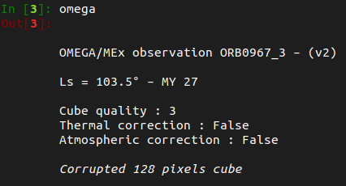

## Reading the binaries

Similarly to the `readomega.pro` IDL routine of the *SOFT 10*, OMEGA-Py read the level 1B binary
*.QUB* & *.NAV* files that can be downloaded from the ESA 
[PSA](https://archives.esac.esa.int/psa/#!Table%20View/OMEGA=instrument) to generate level 2A
data with reflectance spectra. 

!!! warning "Attention"
    OMEGA-Py assumes filenames with uppercase letters and not lowercase, so pay
    attention if you download the data from the PDS instead of the PSA. 

Unlike the IDL software, the module has been implemented with Object Oriented
Programming (OOP), which makes easier the simultaneous handling of different
OMEGA observations. The loading of an OMEGA observation is done by calling the
`#!py __init__` method of the
[`OMEGAdata`](../reference/omega_data/#omega_data.OMEGAdata) class.

!!! example
    `#!py omega = OMEGAdata("0967_3")` to load the cube 0967_3. 

!!! tip "OMEGA files stored in subdirectories"
    OMEGA-Py can handle storage of the OMEGA binary files (*.QUB* & *.NAV*)
    in subdirectories, similarly to how it is stored on the PSA, 
    with also potentially data and geometry files in separate folders.
    When calling `#!py omega = OMEGAdata("0967_3")` for instance, a recursive
    search is performed from the parent directory defined by `omega_bin_path`,
    independantly for the *.QUB* and *.NAV* files.

The user can then access all
the data (reflectance, geometry, wavelengths…) from the attributes of the newly
created omega object. 

!!! tip "Automatically cleaned spectra"
    The wavelengths are also automatically reordered in ascending order and the
    spectra are "cleaned" to remove the overlaps between the three channels of
    the instrument (V, C, L) along with the corrupted spectels as identified in
    the ic array of readomega.

!!! tip "Cube ID"
    As shown in the figure below, OMEGA-Py will search for any matching observation
    in the data present on the machine when calling 
    [`OMEGAdata`](../reference/omega_data/#omega_data.OMEGAdata).
    If the exact ID of the OMEGA cube ('XXXX_N') is not provided and there is an
    ambiguity, it will show you the possible products and ask you to choose the
    one you want by entering the corresponding number (see figure below).

<figure markdown>
  
  <figcaption>
    Verbose importation of cube ORB0967_3.
  </figcaption>
</figure>

### Non-verbose importation

By default, OMEGA-Py will display some informations in the console while reading the
binary files, as the original IDL `readomega.pro` routine (see above figure).
However, this may be unwanted in some cases, especially when dealing with a large number
of observations if you want to use some king of progress bar 
(like [tqdm](https://tqdm.github.io/)) for instance.

Thus, we included a way to disable this display: simply set the `disp` parameter to `#!py False`
when loading the OMEGA observation (see figure below).

!!! example
    `#!py omega = OMEGAdata("0967_3", disp=False)` to load the cube 0967_3 without
    displaying any information in the console.

<figure markdown>
  
  <figcaption>
    Non-verbose importation of cube ORB0967_3.
  </figcaption>
</figure>

### Ignoring some channels

Compared to the C channel (0.93–2.73 μm), the V (0.35–1.05 μm) and L (2.55–5.1 μm) channels
require additional specific corrections to generate the L1B data from the binaries.
We are talking here about seconds or less, but when dealing with large datasets of hundreds
to thousands of observations it may become a noticeable amount of time.

Thus, it is possible to skip these correction steps the `corrV` and/or `corrL` parameters
to `#!py False` when loading the OMEGA observation:

~~~python
# Loading cube 0967_3 with all channels corrections
omega      = OMEGAdata('0967_3')
# No V channel correction
omega_noV  = OMEGAdata('0967_3', corrV=False)
# No L channel correction
omega_noL  = OMEGAdata('0967_3', corrL=False)
# No V & L channels corrections
omega_noVL = OMEGAdata('0967_3', corrV=False, corrL=False)
~~~

!!! danger
    Always be careful when using this feature, especially if you save the data after the
    importation. The data from the V & L channels will still be present in the
    [`OMEGAdata`](../reference/omega_data/#omega_data.OMEGAdata) object anyway, but they
    should not be used as they did not go over the entire instrumental correction process.

!!! info "Checking the correction status of the channels"
    It is possible to check the status of the corrections of the V & L channels of an
    [`OMEGAdata`](../reference/omega_data/#omega_data.OMEGAdata) object via the values
    of the booleans:
    ~~~python
    omega.corrV     # True if V-channel correction applied

    omega.corrL     # True if L-channel correction applied
    ~~~

## Accessing the file headers

Even though many informations from the *.QUB* and *.NAV* files headers are accessible
as attributes of the [`OMEGAdata`](../reference/omega_data/#omega_data.OMEGAdata) class,
it is also possible to get the full headers as dictionaries with the 
[`get_header_qub`](http://127.0.0.1:8000/omegapy/reference/omega_data/#omega_data.OMEGAdata.get_header_qub)
and
[`get_header_nav`](http://127.0.0.1:8000/omegapy/reference/omega_data/#omega_data.OMEGAdata.get_header_nav)
methods:

~~~py
header_qub = omega.get_header_qub() # Header of the .QUB file (dict)

header_nav = omega.get_header_nav() # Header of the .NAV file (dict)
~~~

## Cube quality

A `data_quality` attribute is provided as part of the
[`OMEGAdata`](../reference/omega_data/#omega_data.OMEGAdata) class.
It incidates possible problems within the data cube. A data cube is transmitted
as sets of 64 spectra ("slices"). There are 500 to 1500 slices in a typical
data cube. Each slice is transmitted as 6 TM packets. A typical cube
corresponds to 3000 to 9000 TM packets.

The values of this index are the following:

| Quality   | Description   |       |
| :-----:   | :----------   | ----- |
| **5**     | perfect       |       |
| **4**     | one data gap  | *(gap of 40 TM packets or more)* |
| **3**     | missing data  | *(up to 9 TM packets are missing or corrupted)* |
| **2**     | acceptable    | *(< 3 gaps, < 10 isolated missing packets)* |
| **1**     | poor          | *(3 to 5 gaps or 10 to 100 isolated missing packets)* |
| **0**     | bad           | *(> 5 gaps or > 100 missing/corrupted packets)* |

## Data representation

The representation of an [`OMEGAdata`](../reference/omega_data/#omega_data.OMEGAdata) object
in the console provides several informations about the OMEGA observation (see figure below):

 * The cube ID (orbit and cube number).
 * The major version of OMEGA-Py used to generate the object from the binaries.
 * The Solar longitude (L~s~).
 * The Martian Year (MY).
 * The cube quality.
 * Status of the thermal & atmospheric corrections.
 * If applicable, additional informations contained in the `omega.add_infos` attribute.

<figure markdown>
  
  <figcaption>
    Representation of an OMEGAdata object.
  </figcaption>
</figure>

