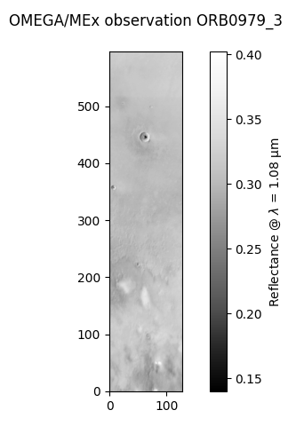
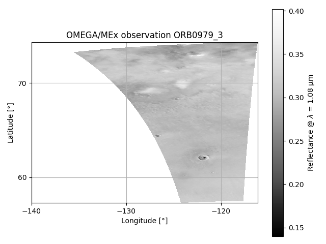
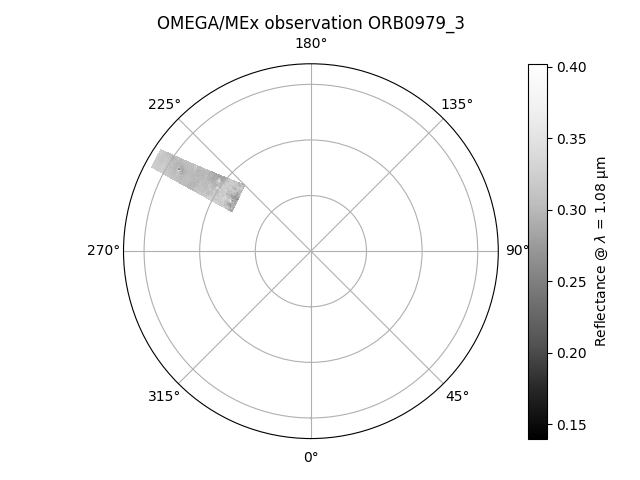
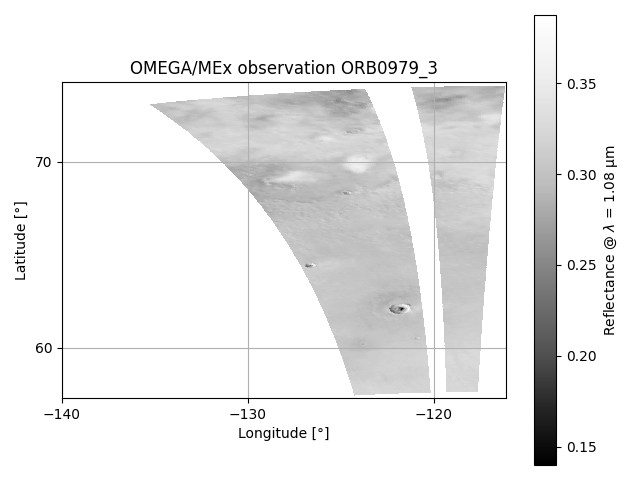
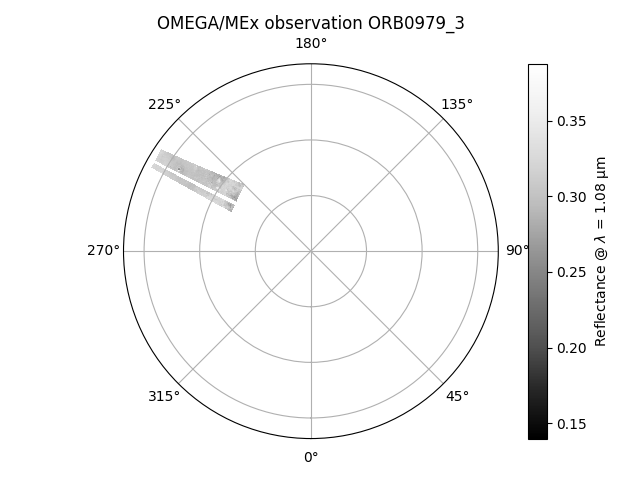
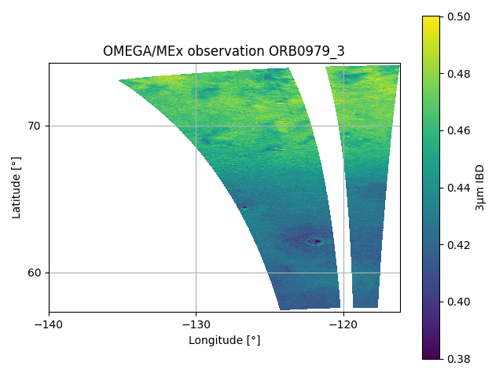
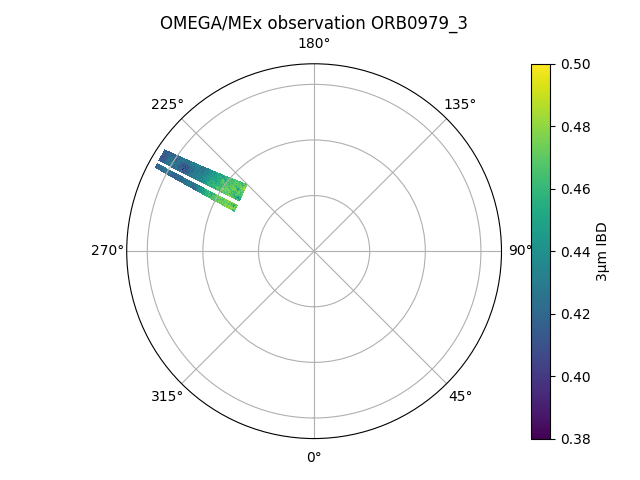
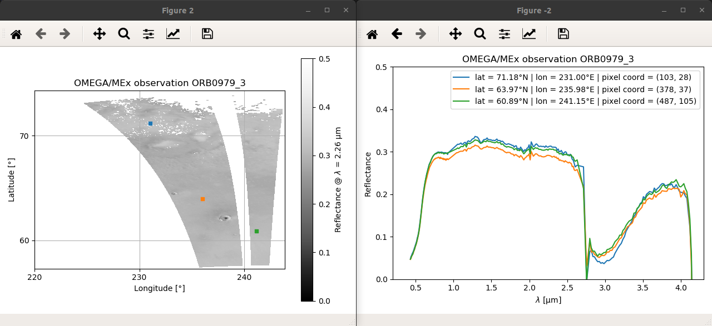
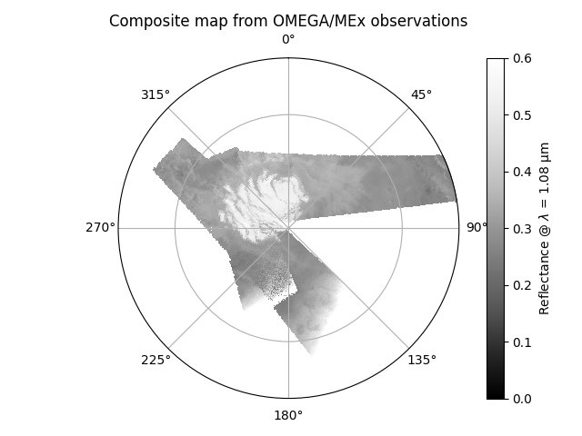
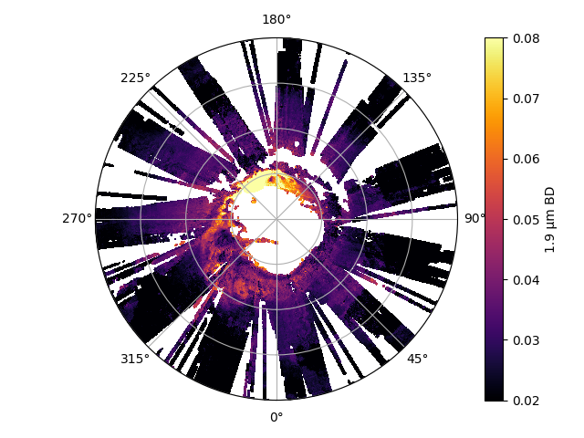

OMEGA-Py comes with a series of visualization functions specifically developed.
All of them are packed in [`omegapy.omega_plots`](../reference/omega_plots/),
the user can choose to project the data on a lat/lon grid or a polar view, or
display the image without projection.

In the following, we assume that we have already loaded the module and a corrected OMEGA observation
as follows:
~~~python
import omegapy.omega_data as od
import omegapy.omega_plots as op

omega = od.autoload_omega('0979_3', therm_corr=True, atm_corr=True)
~~~

## Unprojected data

The first way to display OMEGA data is to show one slice of the cube using [matplotlib.pyplot.imshow](https://matplotlib.org/stable/api/_as_gen/matplotlib.axes.Axes.imshow.html#matplotlib-axes-axes-imshow).
The figure axes are here the X, Y axes of the data cube, in pixels, 
without considering the geometry.

This is done by calling the [show_omega](../reference/omega_plots/#omega_plots.show_omega)
function, which requires an [`OMEGAdata`](../reference/omega_data/#omega_data.OMEGAdata) object
and a given wavelength (in μm).

~~~python
op.show_omega(omega, lam=1.085)
~~~

<figure markdown>
  
  <figcaption>
    ORB0979_3 reflectance – Non-projected
  </figcaption>
</figure>

## Data projection

The other way to display an OMEGA observation is to use the geometry information for
each pixel to project the image on a longitude/latitude grid.
Here we use the coordinates of the corners of the OMEGA pixels to plot the image
with [matplotlib.pyplot.pcolormesh](https://matplotlib.org/stable/api/_as_gen/matplotlib.pyplot.pcolormesh.html).

The advantage of this visualization is that it gives a direct access to the
geographic coordinates of the observed features, and it render the actual
shape of the OMEGA pixels, instead of assuming that they are all squares
with the same size.

This is done by all the `*_v2` functions of [`omega_plots`](../reference/omega_plots/).

### Equatorial projection

The display of an OMEGA observation on a regular equatorial longitude/latitude
grid can be obtain by using the [`show_omega_v2`](../reference/omega_plots/#omega_plots.show_omega_v2) function.
Similarly to [`show_omega`](../reference/omega_plots/#omega_plots.show_omega),
all it needs is an [`OMEGAdata`](../reference/omega_data/#omega_data.OMEGAdata) object
and a wavelength (in μm).

!!! info
    Several other parameters to customize the plot are available, see the [API documentation
    of the function](../reference/omega_plots/#omega_plots.show_omega_v2).

~~~python
op.show_omega_v2(omega, lam=1.085)
~~~

<figure markdown>
  
  <figcaption>
    ORB0979_3 reflectance – Equatorial projection
  </figcaption>
</figure>

!!! tip "Longitude range"
    Two options are possible to display the longitudes and can be selected
    with the `negatives_longitudes` argument (valid for all functions
    that use equatorial projection, including composite maps):

     * `negatives_longitudes = False` --> Longitudes between 0°E and 360°E
     * `negatives_longitudes = True` --> Longitudes between -180°E and 180°E

    By default, it will pick the one that seems the most adapted to the min/max
    longitudes of the observation. Especially in order to avoid splitting it
    on both edges of the figure.

### Polar projection

For observations that are located at high latitudes, close to the poles, it may
be preferred to use a polar projection for the axes instead of an equatorial projection.
This can be done simply by adding `#!py polar=True` in the call of the function.

~~~python
op.show_omega_v2(omega, lam=1.085, polar=True)
~~~

<figure markdown>
  
  <figcaption>
    ORB0979_3 reflectance – Polar projection
  </figcaption>
</figure>

!!! tip "Selecting the pole"
    By default, the function will automatically select the hemisphere and latitude
    range to have the best rendering of the observation.
    But the hemisphere can also be selected manually but setting the latitude bounds
    of the figure with the `latlim` argument:

     * `latlim = (90, 0)` for the entire North hemisphere
     * `latlim = (-90, 0)` for the entire South hemisphere

## Applying masks

Let's assume you have generated a mask associated with your OMEGA observation,
stored in the `data_mask` array,
and you want to hide the flagged pixels while displaying the data.

~~~python
data_mask = od.omega_mask(
    omega, 
    hide_128=True, 
    emer_lim=10, 
    inci_lim=70, 
    temc_lim=-194, 
    limsat_c=500
    )
~~~

This is simply done by passing the `data_mask` array to the `mask`
parameter of the [`show_omega_v2`](../reference/omega_plots/#omega_plots.show_omega_v2)
function:

~~~python
op.show_omega_v2(omega, lam=1.085, polar=False, mask=data_mask)
~~~

<figure markdown>
  
  <figcaption>
    ORB0979_3 reflectance – Equatorial projection with mask
  </figcaption>
</figure>

Same example with polar viewing:
~~~python
op.show_omega_v2(omega, lam=1.085, polar=True, mask=data_mask)
~~~

<figure markdown>
  
  <figcaption>
    ORB0979_3 reflectance – Polar projection with mask
  </figcaption>
</figure>

## Reflectance *vs* previously computed data

It is possible to replace the reflectance by any data array derived from the OMEGA
observation (assuming the X,Y dimensions remains identical), to show for instance
the spatial variations of a spectral criterion 
(e.g., [example 1 – Band depth](example1_band_depth.md)).

This is done by using the [`show_data_v2`](../reference/omega_plots/#omega_plots.show_data_v2)
function, which is very similar to [`show_omega_v2`](../reference/omega_plots/#omega_plots.show_omega_v2)
except that instead of requiring a wavelength (`lam`) it uses an array of floats that
will replace the reflectance values (`data`).

!!! tip "Colorbar"
    Unlike the case of the reflectance, here the function cannot know by itself the
    nature of the data that you are plotting.
    Thus, you need to define the title of the colorbar with the `cb_title` argument
    (otherwise it will be set to `'data'` by default).

    It is also possible to deactivate the display of the colorbar with `cbar=False`,
    which may be useful when plotting multiple maps on the same figure
    (i.e., see [example 2 – Overplotting](example2_overplot.md)).

Here we assume that we have computed the 3μm IBD defined in Jouglet et al. (2007)[^1]
(also referred as "*Wide* 3μm BD" in Stcherbinine et al. (2021)[^2]) for the cube
ORB0979_3, and stored it in the array `ibd30`.

[^1]: D. Jouglet, F. Poulet, R. E. Milliken, et al. (2007). 
Hydration state of the Martian surface as seen by Mars Express OMEGA : 1. Analysis of the 3 μm hydration feature. 
*Journal of Geophysical Research: Planets, 112*, E08S06. 
[doi:10.1029/2006JE002846](http://dx.doi.org/10.1029/2006JE002846)

~~~python
op.show_data_v2(omega, data=ibd30, cb_title="3μm wide BD", mask=data_mask, polar=False)
~~~

<figure markdown>
  
  <figcaption>
    ORB0979_3 3μm IBD – Equatorial projection with mask
  </figcaption>
</figure>

Same example with polar viewing:
~~~python
op.show_data_v2(omega, data=ibd30, cb_title="3μm wide BD", mask=data_mask, polar=True)
~~~

<figure markdown>
  
  <figcaption>
    ORB0979_3 3μm IBD – Polar projection with mask
  </figcaption>
</figure>

## Interactive visualization

One of the very useful features for the exploration of OMEGA data is the
interactive display, similar to what can be done with *ENVI* for IDL users. By
clicking with the mouse on the OMEGA image (reflectance or derived map), the
user can explore and extract the spectra from every pixel of the map.

Plus, by holding the ++ctrl++ key while clicking on the map, it is possible
to select multiple spectra.

!!! tip "Important note for the interactive visualization"
    Using the interactive function requires to have the figure displayed in an external window.
    So if you are using Jupyter or an IDE like Spyder, make sure to configure matplotlib for that.
    
    For instance, assuming you've already installed a Qt binding, e.g., with:
    ~~~bash
    pip install pyqt5
    ~~~
    you can activate it with
    ~~~python
    %matplotlib qt
    ~~~
    (put this line at the beginning of your Jupyter notebook, or in your IDE console)

This is done by calling the [`show_omega_interactif_v2`](../reference/omega_plots/#omega_plots.show_omega_interactif_v2)
function, which requires an [`OMEGAdata`](../reference/omega_data/#omega_data.OMEGAdata) object
and either a wavelength (`lam`, in μm) or a data array to display (`data`):

!!! info
    If `data` is provided, 
    [`show_data_v2`](../reference/omega_plots/#omega_plots.show_data_v2) will be used
    to display the map, otherwise it will be
    [`show_omega_v2`](../reference/omega_plots/#omega_plots.show_omega_v2).
    So other customization arguments of these functions can be used here.

~~~python
op.show_omega_interactif_v2(
    omega,
    lam = 2.26,
    mask = data_mask,
    vmin = 0,
    vmax = 0.5,
    data = None,    # Can be used to replace the reflectance by an other pre-computed map
    )
~~~

<figure markdown>
  
  <figcaption>
    Interactive display of cube ORB0979_3   Equatorial projection of surface reflectance at
    2.26 μm with mask.
  </figcaption>
</figure>

## Composite maps

OMEGA-Py provides functions to generate composite maps from multiple OMEGA
observations, with either the reflectance or previously processed high-level
maps (such as band depth). For instance, the maps in figures 3 to 5 of
Stcherbinine et al. (2021)[^2] have been generated using OMEGA-Py functions.

[^2]: A. Stcherbinine, M. Vincendon, F. Montmessin, P. Beck (2021). 
Identification of a new spectral signature at 3 µm over Martian northern high latitudes: implications for surface composition. 
*Icarus, 369*, 114627. 
[doi:10.1016/j.icarus.2021.114627](https://doi.org/10.1016/j.icarus.2021.114627)

For the following examples, let's assume we have loaded these 3 OMEGA observations:
~~~python
omega41 = od.autoload_omega('0041_1', therm_corr=True, atm_corr=True)
omega61 = od.autoload_omega('0061_1', therm_corr=True, atm_corr=True)
omega103 = od.autoload_omega('0103_1', therm_corr=True, atm_corr=True)
~~~

### Reflectance

~~~python
op.show_omega_list_v2(
    # OMEGA observations
    [omega41, omega61, omega103],
    # Grid parameters
    lat_min=-90, lat_max=-75,
    lon_min=0, lon_max=360,
    pas_lon=0.1, pas_lat=0.1,
    # Polar viewing
    polar=True,
    # Colorscale min/max
    vmin=0, vmax=0.6,
    # Reflectance wavelength
    lam=1.085,
    # Colormap
    cmap='Greys_r',
    )
~~~

<figure markdown>
  
  <figcaption>
    ORB0041_1/ORB0061_1/ORB0103_1   Reflectance – Polar projection
  </figcaption>
</figure>

### Data & Masks

Let's assume we have now also computed the corresponding masks (`mask_41`, `mask_61`, `mask_103`)
and 1.5μm BD maps (`bd15_41`, `bd15_61`, `bd15_103`).

~~~python
import cmocean.cm as cmo    # Some more very nice colormaps

op.show_omega_list_v2(
    # OMEGA observations
    [omega41, omega61, omega103],
    # Grid parameters
    lat_min=-90, lat_max=-75,
    lon_min=0, lon_max=360,
    pas_lon=0.1, pas_lat=0.1,
    # Polar viewing
    polar=True,
    # Colorscale min/max
    vmin=0, vmax=0.4,
    # Colormap
    cmap=cmo.ice,
    # Data
    data_list = [bd15_41, bd15_61, bd15_103],
    # Masks
    mask_list = [mask_41, mask_61, mask_103],
    # Colorbar title
    cb_title = r'1.5 μm BD',
    )
~~~

<figure markdown>
  
  <figcaption>
    ORB0041_1/ORB0061_1/ORB0103_1   1.5μm BD – Polar projection with mask
  </figcaption>
</figure>

### Projection methods
#### Method 1

#### Method 2

### Saving & Loading composite maps

#### Saving composite map

~~~python
op.save_map_omega_list(
    # OMEGA observations
    omega_list,
    # Grid parameters
    lat_min=50, lat_max=90,
    lon_min=0, lon_max=360,
    pas_lat=0.1, pas_lon=0.1,
    # Data
    data_list=bd_19_list,
    data_desc='1.9 μm BD',
    # Masks
    mask_list=mask_ice_list,
    # Output file parameters
    ext='BD_1.9microns_mask4C',
    sub_folder='mask4C',
    folder='../data',
    )
~~~

#### Loading & displaying previously saved map

~~~python
data_bd19, mask, grid_lat, grid_lon, mask_obs, infos = op.load_map_omega_list(
    '../data/mask4C/res_show_omega_list_v2__lat50-90_pas0.1_lon000-360_pas0.1_BD_1.9microns_mask4C.pkl'
    )

op.show_omega_list_v2_man(
    data_bd19,
    grid_lat,
    grid_lon,
    infos,
    cmap = 'inferno',
    vmin = 0.02,
    vmax = 0.08,
    title = '',
    polar = True,
    cb_title = 'auto',
    )
~~~

<figure markdown>
  
  <figcaption>
    North 1.9μm BD – Polar projection with water ice mask  (Stcherbinine et al., 2021)
  </figcaption>
</figure>

