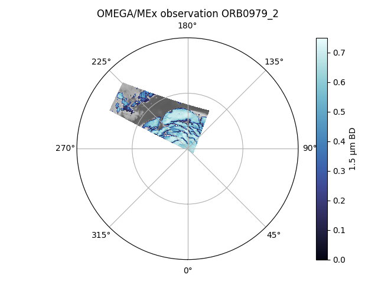
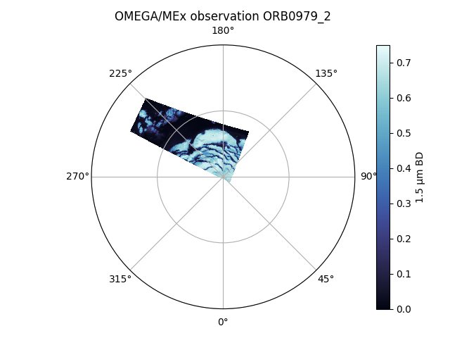
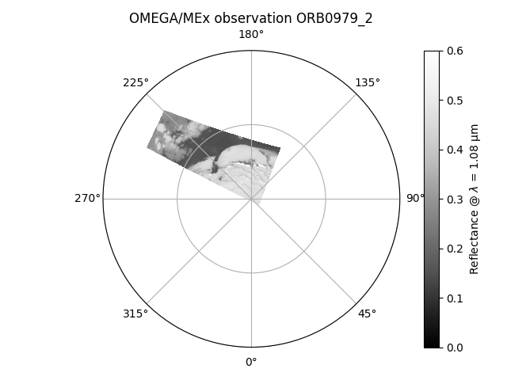

Here is an example on how to overplot multiple map layers with the OMEGA-Py display functions.
In this example will plot a 1.5μm band depth map over a reflectance background to highlight the areas 
covered by water ice.

In the following, we assume that we have already loaded the module and a corrected OMEGA observation
as follows:
~~~python
import omegapy.omega_data as od
import omegapy.omega_plots as op
~~~

Also let's assume that you have completed step 1 to 3 of the [band depth example](../band_depth/) to
process the OMEGA data cube *ORB0979_2* and compute its 1.5μm band depth map.

!!! info "Quick reminder"
    ~~~python
    omega = od.autoload_omega('0972_2')

    bd_15 = od.BD_omega(omega, [1.5, 1.51], 1.30, 1.71, norm=True)
    ~~~

## Step 1 – Define the additional layers

Let's say that you want to show the pixels cover with water ice, that we will define as pixels
with a 1.5μm BD > 10%.
We will create a mask to hide the pixels with no water ice / lower BD:

~~~python
import numpy as np

mask_bd15 = np.ones(bd_15.shape)    # Initialisation with array of 1
mask_bd15[bd_15 < 0.1] = np.nan     # NaN for the pixels with no ice that we want to hide
~~~

## Step 2 – Display the figure

!!! info "Important"
    The important point here is to select the same figure for all the plots, which is handled by
    the `Nfig` argument.

### Plot the background

For the background map, we plot the reflectance at 1.085 μm with 
[`show_omega_v2`](../reference/omega_plots/#omega_plots.show_omega_v2).

We hide the colorbar with `cbar = False` here to only have the one associated with the BD map.

~~~python
op.show_omega_v2(
    omega,
    lam = 1.085,
    polar = True,
    vmin = 0,
    vmax = 0.5,
    cbar = False,   # We don't want to display the colorbar for the reflectance background
    Nfig = 1,       # int or str
    )
~~~

### Plot the BD layer

Then we plot the 1.5 μm BD with [`show_data_v2`](../reference/omega_plots/#omega_plots.show_data_v2)
on the same figure, using the mask to hide the pixels of the BD map without water ice signature.

~~~python
import cmocean.cm as cmo

op.show_data_v2(
    omega,
    data = bd_15,
    mask = mask_bd15,
    polar = True,
    cmap = cmo.ice,
    cb_title = "1.5 μm BD",
    vmin = 0,
    vmax = 0.75,
    Nfig = 1,       # int or str - same as for the background
    )
~~~

!!! tip "Transparent overlays"
    One can also use the `alpha` keyword of the [`show_data_v2`](../reference/omega_plots/#omega_plots.show_data_v2)
    function to set the transparency of the different overlays, in addition or instead of using a mask.

=== "Overplot"
    <figure markdown>
    
    <figcaption>
        ORB0979_2 1.5μm BD on reflectance – Polar projection
    </figcaption>
    </figure>

=== "1.5μm Band Depth"
    <figure markdown>
    
    <figcaption>
        ORB0979_2 1.5μm BD – Polar projection
    </figcaption>
    </figure>

=== "Surface reflectance"
    <figure markdown>
    
    <figcaption>
        ORB0979_2 reflectance – Polar projection
    </figcaption>
    </figure>

