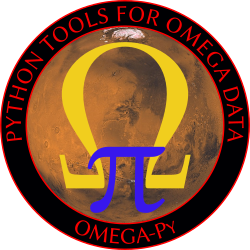

# OMEGA-Py : Python tools for OMEGA data

Importation and display of OMEGA/MEx observations in Python 3, based on the IDL *SOFT10* routines developped in the IAS planetary team.

> **Disclaimer:** This module is not the official software distributed by the OMEGA team.

## Main features
 - Importation of raw PSA-format data.
 - Data correction from instrumental effects.
 - Thermal and atmospheric corrections.
 - Visualization of the data with interactive tools.

## Futures improvement
 - Compatibility with files downloaded from the PDS (lowercase letters) and not only PSA (uppercase letters)
 - Automatic download of files from the PSA FTP
 - Use of a custom atmospheric spectrum for the atmospheric correction
 - Optimization of the customization of display functions
 - Add slider to change the displayed wavelength for the reflectance for interactive plots
 - Simplify the use of the thermal and atmospheric correction functions -> only one with multiple arguments
 - Add filtering options in the `find_cube` function

## Documentation
See [`docs/*.md`](https://github.com/AStcherbinine/omegapy/blob/master/docs/) or the interactive IPython help for more details.

Planetary Data Workshop 2023: [abstract](https://github.com/AStcherbinine/omegapy/blob/master/docs/Stcherbinine_PDW2023_7007_omegapy.pdf) & [slides](https://github.com/AStcherbinine/omegapy/blob/master/docs/PDW_Flagstaff_Stcherbinine_omegapy_upload.pdf)

------------
## Credits

© Aurélien Stcherbinine (2020–2023)

Institut d'Astrophysique Spatiale (IAS), Université Paris-Saclay, CNRS, Orsay, France

LATMOS/IPSL, UVSQ Université Paris-Saclay, Sorbonne Université, CNRS, Guyancourt, France

## License
This package is released under a MIT open source license. See [`LICENSE`](https://github.com/AStcherbinine/omegapy/blob/master/LICENSE) for more details.
